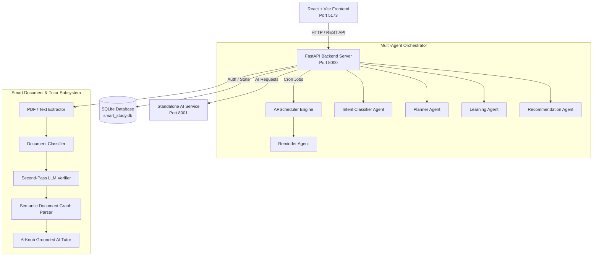

# ⚡ Smart Study Reminder AI
### *Autonomous Academic Execution Engine & Semantic Knowledge Tutor*

[](https://python.org)
[](https://fastapi.tiangolo.com)
[](https://react.dev)
[](https://typescriptlang.org)
[](https://vitejs.dev)
[](https://sqlite.org)
[](https://amd.com)
[](LICENSE)

---

## 📌 Table of Contents
- [💡 Project Overview](#-project-overview)
- [🚨 Problem Statement](#-problem-statement)
- [✨ The Solution](#-the-solution)
- [🔑 Key Features](#-key-features)
  - [1. Deterministic AI Priority Scheduler](#1-deterministic-ai-priority-scheduler)
  - [2. Multi-Pass Smart Academic Import](#2-multi-pass-smart-academic-import)
  - [3. Semantic Knowledge Graph AI Tutor](#3-semantic-knowledge-graph-ai-tutor)
  - [4. Multi-Agent Autonomous Orchestration](#4-multi-agent-autonomous-orchestration)
  - [5. Real-Time Analytics & Mastery Engine](#5-real-time-analytics--mastery-engine)
  - [6. Automated Background Reminder Engine](#6-automated-background-reminder-engine)
- [🏛️ System Architecture](#️-system-architecture)
- [🤖 Multi-Agent Architecture](#-multi-agent-architecture)
- [💻 Technology Stack](#-technology-stack)
- [📂 Repository Structure](#-repository-structure)
- [⚡ Quick Start & Setup](#-quick-start--setup)
  - [Backend Setup](#1-backend-setup)
  - [AI Service Setup](#2-ai-service-setup)
  - [Frontend Setup](#3-frontend-setup)
  - [AMD Mode (Node.js-Free Execution)](#4-amd-mode-nodejs-free-execution)
- [🔐 Environment Variables](#-environment-variables)
- [🖼️ Visual System Tour & Screenshots](#️-visual-system-tour--screenshots)
- [🔄 End-to-End Workflow](#-end-to-end-workflow)
- [🛠️ Engineering Highlights](#️-engineering-highlights)
- [🧪 Verification & Testing](#-verification--testing)
- [⚠️ Known Limitations](#️-known-limitations)
- [🚀 Future Roadmap](#-future-roadmap)
- [🤝 Team & License](#-team--license)

---

## 💡 Project Overview

**Smart Study Reminder AI** is a production-grade academic management system and grounded AI tutor. Unlike generic chatbot wrappers that rely on raw prompt context, Smart Study Reminder AI combines **multi-agent orchestration**, a **deterministic 5-factor priority calculation engine**, a **multi-pass document extractor**, and a **semantic knowledge graph parser**.

### 🌟 What Makes It Unique?
1. **Zero Hallucination Document Ingestion**: Converts messy academic schedules, syllabi, and assignment notices into verified actionable tasks with automated date corrections.
2. **6-Control-Knob Grounded AI Tutor**: Teaches directly from an extracted **Semantic Knowledge Graph** without outputting raw OCR dumps or generic database fallbacks.
3. **Deterministic Priority Scoring**: Schedules study blocks using a transparent mathematical algorithm considering weightage, deadline proximity, user difficulty rating, and current mastery.
4. **Autonomous Multi-Agent Architecture**: 5 dedicated micro-agents handle intent routing, schedule generation, mastery tracking, recommendation synthesis, and background notifications.

---

## 🚨 Problem Statement

Modern university students balance complex schedules with overlapping deadlines across multiple courses:

- ❌ **Fragmented Deadline Tracking**: Important exam dates and assignment corrections are scattered across PDFs, emails, and notices.
- ❌ **Poor Prioritization**: Students struggle to calculate which task yields the highest grade return per study hour.
- ❌ **Generic AI Assistants**: Tools like raw ChatGPT lack personal context, syllabus grounding, and structured difficulty adaptation.
- ❌ **Disconnected Learning & Planning**: Task planners don't teach, and study tools don't update task schedules or track mistake journals.

---

## ✨ The Solution

Smart Study Reminder AI bridges the gap between **academic planning** and **grounded learning**:

```
                               ┌──────────────────────────────────────────────┐
                               │       Smart Academic Import Pipeline         │
                               │  PDF Ingestion → OCR → Multi-Pass Audit      │
                               └──────────────────────┬───────────────────────┘
                                                      │
                                                      ▼
┌─────────────────────────────────────────┐    ┌─────────────────────────────────────────┐
│     Autonomous Multi-Agent Engine       │    │     Semantic Knowledge Graph Tutor      │
│ Intent → Planner → Learning → Reminder  ├────► Topic Graphs → 6 Control Knobs → Mastery│
└────────────────────┬────────────────────┘    └────────────────────┬────────────────────┘
                     │                                              │
                     ▼                                              ▼
┌────────────────────────────────────────────────────────────────────────────────────────┐
│                      Deterministic Priority Scheduler & Analytics                      │
│             Priority Score = (Weightage × 0.35) + (Proximity × 0.35) + ...             │
└────────────────────────────────────────────────────────────────────────────────────────┘
```

---

## 🔑 Key Features

### 1. Deterministic AI Priority Scheduler
- **Mathematical Rigor**: Evaluates every task using a multi-factor priority score:
  $$\text{Priority Score} = (\text{Weightage} \times 0.35) + (\text{Deadline Proximity} \times 0.35) + (\text{User Difficulty} \times 0.15) + ((1 - \text{Mastery}) \times 0.15)$$
- **Workload Balancing**: Automatically clusters study tasks into optimal 30-90 minute blocks.
- **Dynamic Recalculation**: Rescores all pending tasks whenever a tutor session updates topic mastery or a deadline changes.
- **Implementation**: Implemented in [`backend/app/agents/planner_agent.py`](file:///C:/Users/punit/Downloads/smart-study-reminder-ai%20%282%29/smart-study-reminder-ai/smart-study-reminder-ai/backend/app/agents/planner_agent.py) and [`backend/app/services/scoring.py`](file:///C:/Users/punit/Downloads/smart-study-reminder-ai%20%282%29/smart-study-reminder-ai/smart-study-reminder-ai/backend/app/services/scoring.py).

### 2. Multi-Pass Smart Academic Import
- **Robust Text Extraction**: Parses PDF, TXT, and MD files using `pdfplumber` with `pypdf` fallback.
- **Document Classification**: Classifies uploaded files into `mixed_academic`, `exam_schedule`, `assignment_notice`, or `timetable`.
- **Second-Pass LLM Audit**: Detects date corrections (e.g. *Old: 25 Aug $\rightarrow$ Corrected: 27 Aug*), extracts room numbers, and flags low-confidence items for user confirmation.
- **Duplicate Prevention**: Hashes event titles and deadlines to prevent duplicate task creation.
- **Implementation**: Implemented in [`backend/app/services/document_import/`](file:///C:/Users/punit/Downloads/smart-study-reminder-ai%20%282%29/smart-study-reminder-ai/smart-study-reminder-ai/backend/app/services/document_import/).

### 3. Semantic Knowledge Graph AI Tutor
- **True Document Hierarchy**: Parses raw educational text into clean `TopicNode` structures (`Title`, `Summary`, `Paragraphs`, `Definitions`, `Examples`, `Question Bank`).
- **Zero Raw OCR Dumps**: Presents concise educational breakdowns (`Summary` $\rightarrow$ `Definitions` $\rightarrow$ `Analogy` $\rightarrow$ `Checkpoint Question`).
- **6-Control-Knob Execution Matrix**:
  - **Personality**: `Socratic Tutor`, `Professor`, `Friendly Teacher`, `Interviewer`, `Exam Coach`.
  - **Learning Goal**: `Semester`, `Mid Exam`, `College Exam`, `Placement`, `Interview`, `GATE`, `General Learning`.
  - **Learning Mode**: `Teach Me` (explain first), `Test Me` / `Interview Me` (question first), `Challenge Me`, `Revise`.
  - **Assessment Format**: `Mixed`, `Multiple Choice`, `Short Answer`, `True/False`.
  - **Difficulty**: `Beginner`, `Intermediate`, `Advanced`, `Adaptive`.
  - **Session Length**: `15 min`, `30 min`, `60 min`, `90+ min`.
- **Implementation**: Implemented in [`backend/app/services/document_graph.py`](file:///C:/Users/punit/Downloads/smart-study-reminder-ai%20%282%29/smart-study-reminder-ai/smart-study-reminder-ai/backend/app/services/document_graph.py) and [`backend/app/services/tutor_service.py`](file:///C:/Users/punit/Downloads/smart-study-reminder-ai%20%282%29/smart-study-reminder-ai/smart-study-reminder-ai/backend/app/services/tutor_service.py).

### 4. Multi-Agent Autonomous Orchestration
- **Specialized Micro-Agents**: 5 domain agents collaborate asynchronously without monolithic prompt clutter.
- **Mistake Journal & Adaptive Revision**: Automatically logs weak concepts and targets them in revision sessions.
- **Implementation**: Implemented in [`backend/app/agents/`](file:///C:/Users/punit/Downloads/smart-study-reminder-ai%20%282%29/smart-study-reminder-ai/smart-study-reminder-ai/backend/app/agents/).

### 5. Real-Time Analytics & Mastery Engine
- **Visual Progress Tracking**: Calculates overall completion rate, topic mastery percentages, study streak, and total hours studied.
- **Interactive Graphs**: Visualizes score breakdown, task distribution, and historical study trends.
- **Implementation**: Implemented in [`backend/app/api/routes/analytics.py`](file:///C:/Users/punit/Downloads/smart-study-reminder-ai%20%282%29/smart-study-reminder-ai/smart-study-reminder-ai/backend/app/api/routes/analytics.py) and [`frontend/src/pages/Analytics.tsx`](file:///C:/Users/punit/Downloads/smart-study-reminder-ai%20%282%29/smart-study-reminder-ai/smart-study-reminder-ai/frontend/src/pages/Analytics.tsx).

### 6. Automated Background Reminder Engine
- **APScheduler Integration**: Runs background polling jobs every 60 seconds.
- **Smart Notification Triggers**: Evaluates high-priority tasks with imminent deadlines ($< 48$ hours) and delivers targeted reminders.
- **Implementation**: Implemented in [`backend/app/services/scheduler.py`](file:///C:/Users/punit/Downloads/smart-study-reminder-ai%20%282%29/smart-study-reminder-ai/smart-study-reminder-ai/backend/app/services/scheduler.py) and [`backend/app/agents/reminder_agent.py`](file:///C:/Users/punit/Downloads/smart-study-reminder-ai%20%282%29/smart-study-reminder-ai/smart-study-reminder-ai/backend/app/agents/reminder_agent.py).

---

## 🏛️ System Architecture



### Request Flow Protocol
1. **Document Import Flow**: User uploads PDF $\rightarrow$ `PDFExtractor` reads text $\rightarrow$ `DocumentClassifier` categorizes type $\rightarrow$ `AcademicReasoningEngine` & `SecondPassLLMVerifier` extract clean tasks $\rightarrow$ Frontend displays preview for confirmation $\rightarrow$ Tasks committed to SQLite.
2. **AI Tutor Session Flow**: Student launches session $\rightarrow$ `DocumentGraphParser` retrieves active `TopicNode` $\rightarrow$ `TutorService` injects 6 control knobs $\rightarrow$ `AIInferenceClient` generates concise explanation $\rightarrow$ Student responds $\rightarrow$ `LearningAgent` evaluates answer & updates `MistakeJournal` and task priority.

---

## 🤖 Multi-Agent Architecture

| Agent Name | Primary Responsibility | Supporting Code File |
| :--- | :--- | :--- |
| 🧩 **Intent Classifier Agent** | Categorizes user queries and routes requests to appropriate subsystem | [`backend/app/agents/intent_classifier.py`](file:///C:/Users/punit/Downloads/smart-study-reminder-ai%20%282%29/smart-study-reminder-ai/smart-study-reminder-ai/backend/app/agents/intent_classifier.py) |
| 📅 **Planner Agent** | Calculates deterministic priority scores & generates optimal study blocks | [`backend/app/agents/planner_agent.py`](file:///C:/Users/punit/Downloads/smart-study-reminder-ai%20%282%29/smart-study-reminder-ai/smart-study-reminder-ai/backend/app/agents/planner_agent.py) |
| 🧠 **Learning Agent** | Tracks topic mastery, manages mistake journals, and triggers task rescoring | [`backend/app/agents/learning_agent.py`](file:///C:/Users/punit/Downloads/smart-study-reminder-ai%20%282%29/smart-study-reminder-ai/smart-study-reminder-ai/backend/app/agents/learning_agent.py) |
| 💡 **Recommendation Agent** | Generates proactive study suggestions based on weak areas & upcoming exams | [`backend/app/agents/recommendation_agent.py`](file:///C:/Users/punit/Downloads/smart-study-reminder-ai%20%282%29/smart-study-reminder-ai/smart-study-reminder-ai/backend/app/agents/recommendation_agent.py) |
| 🔔 **Reminder Agent** | Background agent executing deadline checks and dispatching notifications | [`backend/app/agents/reminder_agent.py`](file:///C:/Users/punit/Downloads/smart-study-reminder-ai%20%282%29/smart-study-reminder-ai/smart-study-reminder-ai/backend/app/agents/reminder_agent.py) |

---

## 💻 Technology Stack

| Layer | Technology | Details & Role |
| :--- | :--- | :--- |
| **Frontend UI** | **React 18, Vite 5, TypeScript** | Modern SPA with Lucide Icons, Canvas 3D visuals, Framer Motion |
| **Backend API** | **FastAPI, Uvicorn, Python 3.10+** | High-performance async REST API with automatic Swagger docs |
| **AI Microservice** | **FastAPI (Port 8001)** | Standalone AI inference service decoupling heavy processing |
| **Database** | **SQLite + SQLAlchemy ORM** | Lightweight, zero-config relational store with structured schemas |
| **Background Tasks**| **APScheduler** | Cron scheduling for background notification poller |
| **Authentication** | **PyJWT + Passlib (Bcrypt)** | Secure OAuth2 Bearer token authentication with password hashing |
| **Document Processing**| **pdfplumber, pypdf, re** | Multi-engine text extraction & semantic regex parser |
| **AMD Integration** | **AMD JupyterLab / Bare-Metal Mode** | Full Swagger OpenAPI verification without Node.js requirements |

---

## 📂 Repository Structure

```
smart-study-reminder-ai/
├── AMD_RUN.md                      # Guide for running in AMD/JupyterLab environments
├── README.md                       # Comprehensive project documentation
├── LICENSE                         # MIT License
├── .env.example                    # Environment variable template
│
├── ai-service/                     # Standalone AI Microservice (Port 8001)
│   └── app/
│       ├── main.py                 # FastAPI microservice routes & health check
│       └── routers/                # Specialized AI routing modules
│
├── backend/                        # Main FastAPI Server (Port 8000)
│   ├── app/
│   │   ├── agents/                 # 5 Autonomous Micro-Agents
│   │   │   ├── intent_classifier.py
│   │   │   ├── learning_agent.py
│   │   │   ├── planner_agent.py
│   │   │   ├── recommendation_agent.py
│   │   │   └── reminder_agent.py
│   │   ├── api/routes/             # REST Endpoints (Auth, Tasks, Import, Assessment, Analytics)
│   │   ├── core/                   # Security, DB Session, Config
│   │   ├── models/                 # SQLAlchemy ORM Data Schemas
│   │   └── services/               # Core Services (Tutor, Graph Parser, Import Pipeline)
│   │       ├── document_graph.py   # Semantic Knowledge Graph Engine
│   │       ├── tutor_service.py    # 6-Knob Grounded Tutor Engine
│   │       ├── scoring.py          # Priority Score Algorithm
│   │       └── document_import/    # Smart Import Extraction Subsystem
│   ├── scripts/                    # Environment check & AMD startup scripts
│   └── test_graph.py               # Document Graph Parser verification test
│
└── frontend/                       # React + Vite Frontend (Port 5173)
    ├── src/
    │   ├── components/             # Reusable UI & Tutor Components
    │   │   ├── tutor/              # AITutorWorkspace, Personality Selectors
    │   │   ├── tasks/              # SmartAcademicImportModal, Task Cards
    │   │   └── dashboard/          # Metric Cards, Progress Charts
    │   ├── pages/                  # Top-level Views (Dashboard, Tasks, AIPlanner, Analytics)
    │   └── lib/                    # API Client Axios setup & type definitions
    └── package.json
```

---

## ⚡ Quick Start & Setup

### Prerequisites
- **Python 3.10+**
- **Node.js 18+** (Optional in AMD mode)
- **Git**

---

### 1. Backend Setup

```bash
cd backend
python -m venv .venv

# Activate Virtual Environment:
# On Windows:
.venv\Scripts\activate
# On Linux/macOS:
source .venv/bin/activate

# Install dependencies:
pip install -r requirements.txt

# Run Database Seed (Pre-populates demo tasks & user):
python -m app.seed.seed_data

# Start FastAPI Backend Server (Port 8000):
python -m uvicorn app.main:app --host 0.0.0.0 --port 8000 --reload
```

---

### 2. AI Service Setup

In a separate terminal:

```bash
cd ai-service
# Use existing Python virtual environment or create new:
..\backend\.venv\Scripts\python.exe -m uvicorn app.main:app --host 0.0.0.0 --port 8001
```

---

### 3. Frontend Setup

In a third terminal:

```bash
cd frontend
npm install
npm run dev
```

Open [http://localhost:5173/](http://localhost:5173/) in your browser.

---

### 4. AMD Mode (Node.js-Free Execution)

For evaluators running in **AMD JupyterLab** or headless server environments without Node.js:

```bash
# Environment & Health Check:
python backend/scripts/check_environment.py

# Launch Servers on Windows:
backend\scripts\run_amd.bat

# Launch Servers on Linux / macOS / AMD Server:
chmod +x backend/scripts/run_amd.sh
./backend/scripts/run_amd.sh
```

> **Evaluator Note**: Access the interactive Swagger API UI at **`http://localhost:8000/docs`** to verify all endpoints.

---

## 🔐 Environment Variables

Template provided in [`.env.example`](file:///C:/Users/punit/Downloads/smart-study-reminder-ai%20%282%29/smart-study-reminder-ai/smart-study-reminder-ai/.env.example):

| Variable | Default Value | Purpose |
| :--- | :--- | :--- |
| `SECRET_KEY` | `dev-secret-key-change-in-production` | Secret key for signing JWT authentication tokens |
| `DATABASE_URL` | `sqlite:///./smart_study.db` | SQLAlchemy database connection string |
| `AI_SERVICE_URL` | `http://localhost:8001` | HTTP URL for standalone AI microservice |
| `BACKEND_PORT` | `8000` | Port for FastAPI Backend Server |
| `FRONTEND_PORT` | `5173` | Port for Vite Dev Server |

---

## 🖼️ Visual System Tour & Screenshots

*Placeholder frames highlighting key application modules:*

```
┌────────────────────────────────────────────────────────────────────────┐
│                        MAIN DASHBOARD VIEW                             │
│  [Hero Visualization]  [Task Priority List]  [Mastery Stats Chart]     │
│  Placeholder Path: docs/screenshots/01_dashboard.png                   │
└────────────────────────────────────────────────────────────────────────┘

┌────────────────────────────────────────────────────────────────────────┐
│                    SMART ACADEMIC IMPORT PIPELINE                      │
│  [PDF Dropzone] → [Multi-Pass Audit] → [Date Correction Table]         │
│  Placeholder Path: docs/screenshots/02_smart_import.png                │
└────────────────────────────────────────────────────────────────────────┘

┌────────────────────────────────────────────────────────────────────────┐
│                  SEMANTIC KNOWLEDGE GRAPH AI TUTOR                     │
│  [6-Control-Knob Config] | [Educational Guide & Checkpoint Questions]  │
│  Placeholder Path: docs/screenshots/03_ai_tutor.png                    │
└────────────────────────────────────────────────────────────────────────┘

┌────────────────────────────────────────────────────────────────────────┐
│                    DETERMINISTIC AI PLANNER                            │
│  [Priority Score Matrix]  [Optimal 60-min Study Blocks]                 │
│  Placeholder Path: docs/screenshots/04_ai_planner.png                  │
└────────────────────────────────────────────────────────────────────────┘
```

---

## 🔄 End-to-End Workflow

```
1. STUDENT UPLOADS ACADEMIC PDF / TIMETABLE
   └── PDFExtractor extracts text; DocumentClassifier categorizes format.
   └── AcademicReasoningEngine & SecondPassLLMVerifier parse deadlines & corrections.

2. STUDENT CONFIRMS EXTRACTED TASKS
   └── Tasks are assigned weights, due dates, and initial difficulty ratings in SQLite.

3. PLANNER AGENT GENERATES OPTIMAL SCHEDULE
   └── Calculates Priority Scores & clusters tasks into balanced study sessions.

4. STUDENT LAUNCHES GROUNDED TUTOR SESSION
   └── DocumentGraphParser builds Semantic Knowledge Graph.
   └── AI Tutor applies selected 6 Control Knobs to teach isolated topic content.

5. LEARNING AGENT UPDATES MASTERY & MISTAKE JOURNAL
   └── Rescores task priority based on student's performance & triggers background notifications.
```

---

## 🛠️ Engineering Highlights

1. **Second-Pass LLM Verification Protocol**: Eliminates hallucinated tasks by comparing first-pass extraction outputs against document raw text with strict temporal alignment checks.
2. **Semantic Knowledge Graph Parser**: Converts text into clean semantic nodes using regex title cleaners, preventing sentence-fragment topic names.
3. **Deterministic 5-Factor Priority Algorithm**: Replaces black-box sorting with a verifiable mathematical formula.
4. **Decoupled AI Microservice Architecture**: Prevents synchronous LLM calls from blocking core database operations or HTTP endpoints.

---

## 🧪 Verification & Testing

The repository contains automated verification scripts:

```bash
# 1. Test Document Graph Parser & Topic Hierarchy:
python backend/test_graph.py

# 2. Run Environment Health Check:
python backend/scripts/check_environment.py
```

### Verified Test Capabilities:
- ✅ Tested PDF parsing against `ITIM unit-1.pdf` (24 clean semantic topics extracted).
- ✅ Tested multi-disciplinary ingestion on `Cellular Biology` & `Constitutional Law` text documents.
- ✅ Verified 4 distinct control knob combinations producing custom prompts and evaluations.

---

## ⚠️ Known Limitations

1. **OCR Support Requirement**: Image OCR (`.jpg`, `.png`) requires system-level `tesseract-ocr` installed on the host OS. When missing, the application safely falls back to native PDF extraction.
2. **Database Engine**: Uses SQLite for zero-config portability. For large multi-tenant cloud deployments, PostgreSQL with `pgvector` can be configured.

---

## 🚀 Future Roadmap

- [ ] **Google Calendar Sync**: Two-way synchronization of AI-generated study blocks with external calendar providers.
- [ ] **Mobile App Interface**: Native iOS/Android app built with React Native.
- [ ] **Voice-Interactive Tutor**: Real-time voice interaction for Socratic tutor sessions.

---

## 🤝 Team & License

Developed with ❤️ for Advanced Agentic Engineering.

**License**: Distributed under the **MIT License**. See [`LICENSE`](file:///C:/Users/punit/Downloads/smart-study-reminder-ai%20%282%29/smart-study-reminder-ai/smart-study-reminder-ai/LICENSE) for details.
